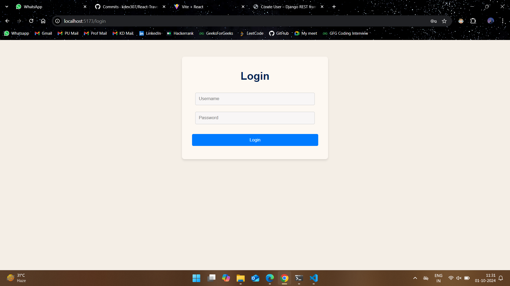
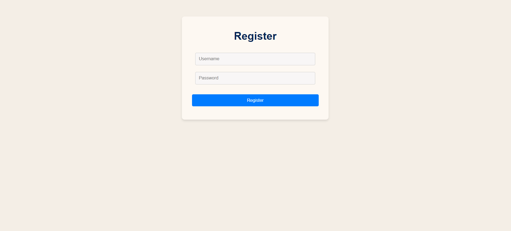
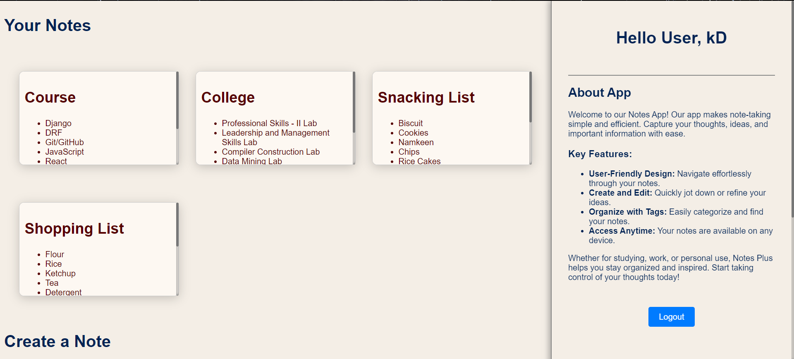
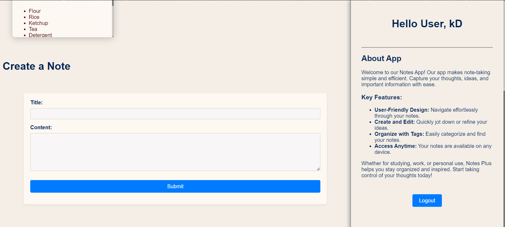
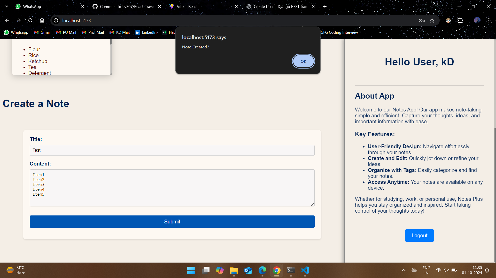

# Django-React-Notes-App

Our app makes note-taking simple and efficient. Capture your thoughts, ideas, and important information with ease.

## Key Features:

-   User-Friendly Design: Navigate effortlessly through your notes.
-   Create and Edit: Quickly jot down or refine your ideas.
-   Organize with Tags: Easily categorize and find your notes.
-   Access Anytime: Your notes are available on any device.

Whether for studying, work, or personal use, Notes Plus helps you stay organized and inspired. Start taking control of your thoughts today!

## Build With :

<ul>
    <li><a href="https://vitejs.dev/" target="_blank">Vite + React</a></li>
    <li><a href="https://www.djangoproject.com/start/" target="_blank">Django</a></li>
    <li><a href="https://www.django-rest-framework.org/" target="_blank">Django Rest Framework (DRF)</a></li>
</ul>

## Install and Run :

-   Clone the repository or download the ZIP folder.
-   Extract the ZIP folder.
-   Create a Virtual Environment (optional but recommended), execute the below command for it:
    -   `python -m venv env`
    -   `source env\bin\activate`
-   Install `NodeJS` on your system.
-   Install `Python 3.x` on your system.

### Backend

-   Install required Python packages using the `requirements.txt` file. Follow below commands:

    -   `cd backend`
    -   `pip install -r requirements.txt`

-   Apply Migrations using below command:
    -   `python manage.py migrate`
-   Run the Django Server:
    -   `python manage.py runserver`

### Frontend

-   Navigate to frontend directory using command:
    -   `cd frontend`
-   Install required Node packages
    -   `npm install`
    -   `npm install axios`
    -   `npm install react-dom`
    -   `npm install react-router-dom`
-   Run the Vite Development Server:
    -   `npm run dev`
-   Launch the application
    -   Launch backend:
        -   backend can be accessed using `localhost:8000/api/user` on browser
        -   for new user registeration `localhost:8000/api/user/register`
    -   Launch frontend:
        -   accessed using `localhost:5173` on browser
        -   routing is done for rest of the pages

#### Note

The default port numbers can be changed during the documentation. Refer documentation for this.

## Screenshots :

Here are some of the screenshot of the full stack web application DfitKlub.

1. Login Page :     
2. Login Page :     
3. Landing Page :     
4. Create Note :     
5. Note Creation :      
6. Delete Note :    
